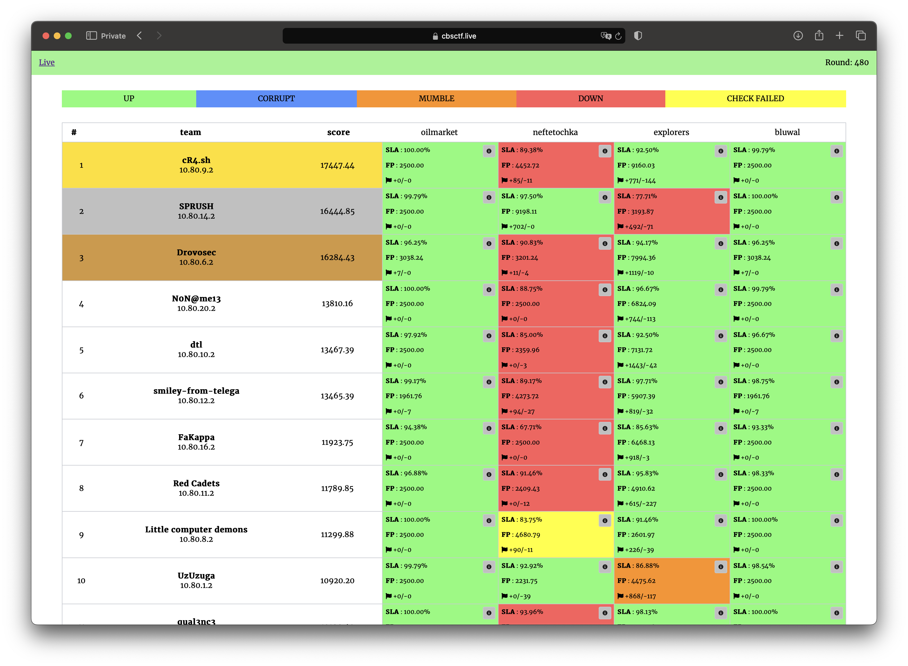

# CTF Cup 2023

The contest was held on December 8, 2023.

Repository contains source code of services, checkers and sploits.

## Results

[Full scoreboard](scoreboard/full.png)

## Services

| Service                                  | Language | Checker                          | Sploits                         | Authors                                                  |
|------------------------------------------|----------|----------------------------------|---------------------------------|----------------------------------------------------------|
| **[explorers](services/explorers/)**     | Python   | [Checker](checkers/explorers/)   | [Sploits](sploits/explorers/)   | [@jnovikov](https://github.com/jnovikov)                 |
| **[oilmarket](services/oilmarket/)**     | Rust     | [Checker](checkers/oilmarket/)   | [Sploits](sploits/oilmarket/)   | [@falamous](https://github.com/falamous)                 |
| **[bluwal](services/bluwal/)**           | Go       | [Checker](checkers/bluwal/)      | [Sploits](sploits/bluwal/)      | [@pomo-mondreganto](https://github.com/pomo-mondreganto) |
| **[neftetochka](services/neftetochka/)** | C++      | [Checker](checkers/neftetochka/) | [Sploits](sploits/neftetochka/) | [@user39043346](https://github.com/user39043346)         |

## Infrastructure

- DevOps: [@pomo_mondreganto](https://github.com/pomo-mondreganto)
- Checksystem: [ForcAD](https://github.com/pomo-mondreganto/ForcAD),
  configuration: [forcad_config.yml](./forcad_config.yml) 
